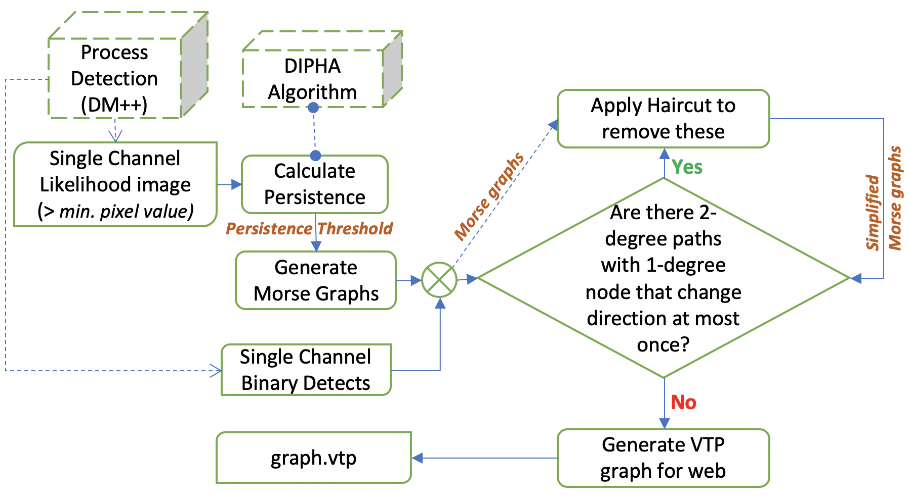

# Full Brain Neuron Fragment 2D Discrete Morse Graph Reconstruction Python Package

## Workflow

## I. Package Description

DiMo2d is a python package meant for executing the discrete Morse graph reconstruction algorithm on the DM++ likelihood outputs of 2D neuron images. The package includes functions which allows users to compute persistence diagrams, generate a discrete Morse graph reconstruction, postprocess the graph reconstruction to capture neuronal fragments, and output the graphs to different formats for each image.

## II. Installation Instructions  
### A. System Requirements:  
    Python 3.8.8 (or newer)  
    g++ 9.4.0 (or newer)  
    cmake 3.16.3 (or newer)  

### B. Required Python Libraries  
    cv2 - pip install opencv-python (https://pypi.org/project/opencv-python/)  
    PIL - pip install pillow (https://pypi.org/project/Pillow/)  
    geojson - pip install geojson (https://pypi.org/project/geojson/)  
    vtk - pip install vtk (https://pypi.org/project/vtk/)  

### C. Compiling C++ Code:  
**Dipha Persistence Module**  

      cd ./DiMo2d/code/dipha-2d-thresh/  
      mkdir build   
      cd build  
      cmake ../   
      make  

**Discrete Morse Graph Reconstruction Module**  

      cd DiMo2d/code/dipha-output-2d-ve-et-thresh/  
      g++ ComputeGraphReconstruction.cpp  

## III. DiMo2d Functions

### DiMo2d.compute_persistence_single_channel(input_dir, output_dir, threads=1)  
**Description**  

For each likelihood image, compute persistence using DIPHA program. Persistence is only computed on edges with vertice function values greater than 31, DM++ minimum likelihood pixel value

**Input:**  

    input_dir - Directory containing stack of DM++ likelihood output tifs  
    output_dir - Directory where results will be stored.  
    threads - number of threads used to run in parallel 
    
**Output:**

Each 2D slice will have its own subdirectory in output_dir named by slice name.  All files required for input be discrete Morse graph reconstruction program will be found in the subdirectories.

**Example:**  

	  import DiMo2d as dm  

    likelihood_dir = “data/likelihood/”  
    morse_dir = “results/likelihood-morse/”  
    dm.compute_persistence_single_channel(likelihood_dir, morse_dir)  

### DiMo2d.generate_morse_graphs(input_path,  binary_dir, ve_persistence_threshold=0, et_persistence_threshold=64, threads=1)

**Description**  
Compute discrete Morse graph reconstruction for each 2D slice.  Graphs are intersected with the DM++ binary outputs to remove false positives.

**Input:**  

    input_path - directory containing results for each slice.  This should be the same as output_dir in DiMo2d.compute_persistence_single_channel  
    binary_dir - path to directory containing the DM++ binary outputs for each slice  
    ve_persistence_threshold - negative critical edge persistence threshold  
    et_persistence_threshold - positive critical edge persistence threshold.  This must be greater than or equal to ve_persistence_threshold  
    threads - number of threads used to run in parallel  

**Output:**

    Morse Graph for each image with specified persistence thresholds.

**Example:**  

    import DiMo2d as dm

    likelihood_dir = “data/likelihood/”  
    binary_dir = “data/binary/”  
    morse_dir = “results/likelihood-morse/”  
    dm.compute_persistence_single_channel(likelihood_dir, morse_dir)  
    dm.generate_morse_graphs(morse_dir, binary_dir, 0, 64)  

### DiMo2d.postprocess_graphs(input_path, ve_persistence_threshold=0, et_persistence_threshold=64, threads=1)

**Description**  
Apply haircut to remove non-degree 2 paths with a node of degree 1 that change direction at most once

**Input:**

    input_path - directory containing results for each slice.  This should be the same as input_path in DiMo2d.compute_persistence_single_channel  
    ve_persistence_threshold - negative critical edge persistence threshold  
    et_persistence_threshold - positive critical edge persistence threshold  
    threads - number of threads used to run in parallel  

**Output:**

    Perform postprocessing of graph at specified thresholds on each slice.

**Example:**

    import DiMo2d as dm  

    likelihood_dir = “data/likelihood/”  
    binary_dir = “data/binary/”  
    morse_dir = “results/likelihood-morse/”  
    dm.compute_persistence_single_channel(likelihood_dir, morse_dir)  
    dm.generate_morse_graphs(morse_dir, binary_dir, 0, 64)  
    dm.postprocess_graphs(morse_dir, 0, 64)  

### DiMo2d.cshl_post_results(input_path, output_dir, ve_persistence_threshold=0, et_persistence_threshold=64, threads=1)

**Description**  
Format graphs of each slice to geojson and ready to post to CSHL webviewer

**Input:**

    input_path - directory containing results for each slice.  This should be the same as input_path in DiMo2d.compute_persistence_single_channel
    output_dir - directory results will be stored
    ve_persistence_threshold - negative critical edge persistence threshold
    et_persistence_threshold - positive critical edge persistence threshold
    threads - number of threads used to run in parallel
    
**Output:**

    Geojson ready to be posted to CSHL webviewer is written for each slice
    
**Example:**

    import DiMo2d as dm

    likelihood_dir = “data/likelihood/”
    binary_dir = “data/binary/”
    morse_dir = “results/likelihood-morse/”
    json_dir = “results/post_to_web/”
    dm.compute_persistence_single_channel(likelihood_dir, morse_dir)
    dm.generate_morse_graphs(morse_dir, binary_dir, 0, 64)
    dm.postprocess_graphs(morse_dir, 0, 64)
    dm.cshl_post_results(morse_dir, json_dir, 0, 64)

### DiMo2d.write_vtp_graph(input_dir, output_filename, ve_persistence_threshold=0, et_persistence_threshold=64)

**Description**

Output single vtp file containing morse graphs of all slices

**Input:**

    input_dir - directory containing results for each slice.  This should be the same as input_path in DiMo2d.compute_persistence_single_channel
    output_filename - name of vtp file output will be written to
    ve_persistence_threshold - negative critical edge persistence threshold
    et_persistence_threshold - positive critical edge persistence threshold
    threads - number of threads used to run in parallel

**Output:**

    A single file (output_filename) written in .vtp format containing graphs of each slice

**Example:**

    import DiMo3d as dm

## IV. Non-Python Code

## C++ programs

### Dipha Persistence Program (code/dipha-2d-thresh/build/dipha)

**Description**

Compute persistence diagram of likelihood image (only on regions with greater pixel value than 31, the likelihood minimum)

**Python Function:**

    DiMo2d.run_dipha_persistence

**Input:**

    input_filename - path to DIPHA input file  
    output_filename - filename for traditional DIPHA program persistence diagram  
    edge_filename - filename for edge information - vertices, edge type (negative or positive), and persistence value  
    nx - x axis size of image  
    ny - y axis size of image  

**Output:**

		Binary file (edge_filename) contained persistence information for all edges

### Discrete Morse Graph Reconstruction Program (code/dipha-output-2d-ve-et-thresh/a.out)

**Description:**

Executes discrete Morse graph reconstruction algorithm

**Python Function:**

### DiMo2d.run_graph_reconstruction

**Input:**

    vert_filename - file contain verts in domain
    dipha_edge_filename - .txt format of edge persistence information
    persistence threshold - persistence threshold for graph reconstruction algorithm
    output_dir - directory where output graph will be written

**Output:**

    Graph (dimo_vert.txt and dimo_edge.txt) written to output_dir

## MATLAB scripts

### Creates DIPHA input file for all subregions

    save_image_data.m

**Python Function:**

    DiMo3d.write_dipha_persistence_input
    
**Input:**

    input_path - input path to directory containing subregions for which we will need to compute persistence on.  This argument should be the same as input_path of a previous DiMo3d.compute_persistence call
    valid_filename - filename containing list of valid subregions.  This is generated within the python code

**Output:**

    DIPHA input file for each subregion.  A subregion’s file is written to its results directory

### DIPHA Persistence Format Conversion

    load_persistence_diagram.m
    
**Description**

Converts DIPHA persistence diagram to .txt format for use by Discrete Morse Graph Reconstruction program

**Python Function:**

		DiMo3d.convert_persistence_diagram

**Input:**

    input_filename - Persistence diagram output directly from DIPHA program (.bin format)
    output_filename - filename for .txt format of persistence diagram

**Output:**

    Persistence Diagram in .txt format for each subregion

## V. Example Use of Pipeline

    import DiMo2d as dm

    likelihood_dir = “data/likelihood/”
    binary_dir = “data/binary/”
    morse_dir = “results/likelihood-morse/”
    json_dir = “results/post_to_web/”
    ve_thresh = 0
    et_thresh = 64
    threads = 4
    dm.compute_persistence_single_channel(likelihood_dir, morse_dir)
    dm.generate_morse_graphs(morse_dir, binary_dir, 0, 64)
    dm.postprocess_graphs(morse_dir, 0, 64)
    dm.cshl_post_results(morse_dir, json_dir, 0, 64)

